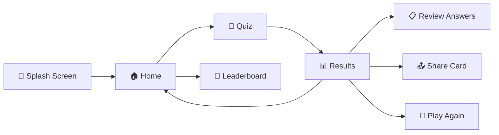

<p align="center">
  
</p>

<h1 align="center">Quizzera</h1>

<p align="center">
  <em>Learn. Test. Master.</em>
</p>

<p align="center">
  
  
  
  
</p>

<p align="center">
  <b>A beautifully crafted iOS trivia quiz app with live API questions, XP progression, haptic feedback, and Instagram-style share cards — built entirely in SwiftUI.</b>
</p>

---

## ✨ Overview

**Quizzera** is a premium, dark-themed trivia quiz app for iOS that pulls questions from the [Open Trivia Database](https://opentdb.com/) API with a seamless offline fallback. It features a rich progression system, confidence-based answer insights, daily streaks, animated results, and shareable score cards — all powered by a clean MVVM architecture using 100% SwiftUI.

---

## 🧠 Features at a Glance

| Feature | Description |
|---|---|
| 🌐 **Live API Questions** | Fetches questions in real-time from OpenTDB with automatic offline fallback |
| 🎯 **4 Categories** | General Knowledge, Technology, Science, Sports |
| 📊 **3 Difficulty Levels** | Easy, Medium, Hard — with point multipliers |
| ⏱️ **15-Second Timer** | Circular countdown with time-based bonus scoring |
| 🔥 **Answer Streaks** | Visual streak counter with animated toast milestones |
| 🤔 **Confidence System** | Rate your confidence before reveal — get personalized insights |
| ⚡ **Skip Lifeline** | One-time skip per quiz session |
| 🏆 **XP & Leveling** | Per-category XP progression: Novice → Apprentice → Scholar → Master → Legendary |
| 📈 **Score Sparkline** | Interactive score trend chart tracking your last 10 quizzes |
| 🔥 **Daily Streak** | Persistent day-by-day play streak counter |
| 🎖️ **Performance Badges** | Dynamic badges from "Keep Learning 📖" to "LEGENDARY 🏆" |
| 🎊 **Confetti Animation** | Celebratory particle effects for legendary scores |
| 📤 **Share Results** | Instagram-story-style share cards rendered as images |
| 👑 **Leaderboard** | Personal top-5 scoreboard with podium visualization |
| 📳 **Haptic Feedback** | Context-aware haptics for selections, correct/wrong answers, timer danger zone |
| 🌙 **Dark Mode First** | Premium dark UI with Electric Purple & Neon Green accent palette |

---

## 🏗️ Architecture

Quizzera follows the **MVVM (Model-View-ViewModel)** pattern with clean separation of concerns:

```
Quizzera/
├── QuizzeraApp.swift          # App entry, color theme, button styles, haptic manager
├── Models/
│   ├── Question.swift         # Question, Category, Difficulty enums
│   └── Result.swift           # QuizResult, AnswerRecord, ConfidenceLevel,
│                              # PerformanceBadge, LeaderboardEntry, CategoryXP, XPLevel
├── ViewModels/
│   ├── QuizViewModel.swift    # Core game engine — timer, scoring, streaks, API integration
│   └── UserDataViewModel.swift # Persistence via UserDefaults — stats, XP, streaks, history
├── Views/
│   ├── SplashScreenView.swift      # Animated launch screen with floating particles
│   ├── HomeScreenView.swift        # Dashboard — stats, categories, difficulty, XP badges
│   ├── QuizScreenView.swift        # Gameplay — timer, questions, answers, confidence picker
│   ├── ResultScreenView.swift      # Animated results — score, badge, breakdown, review
│   ├── LeaderboardScreenView.swift # Personal top-5 scoreboard with podium
│   └── ShareCardView.swift         # Instagram-style share card renderer
├── Services/
│   └── TriviaAPIService.swift # OpenTDB API client (actor-based, async/await)
└── Data/
    └── QuizData.swift         # 40 offline fallback questions (10 per category)
```

---

## 🎮 Gameplay Flow



### 1. **Splash Screen**
Animated launch with a spring-loaded brain icon, gradient glow ring, floating particles, and pulsing background. Transitions smoothly to the home screen after 2.5 seconds.

### 2. **Home Screen**
Your command center — featuring:
- **Personalized greeting** based on time of day (☀️ Morning / 🌤️ Afternoon / 🌅 Evening / 🦉 Night Owl)
- **Stats dashboard** — Best Score, Total Quizzes, Overall Accuracy
- **Score trend sparkline** — visual chart of your last 10 quiz scores
- **Category picker** — 2-column grid with SF Symbols and per-category XP level badges
- **Difficulty selector** — color-coded pills (🟢 Easy / 🟡 Medium / 🔴 Hard)
- **XP progress bar** — shows current level and progress to next tier
- **Daily streak badge** — 🔥 counter in the header

### 3. **Quiz Screen**
Core gameplay with:
- **15-second circular countdown timer** with dynamic color (green → red in danger zone)
- **Time-based scoring** — answer faster for more points (15/10/5 pts based on speed)
- **Live/Offline source badge** — shows 🌐 Live or 📦 Offline question source
- **Question card** with difficulty badge and category icon
- **A/B/C/D answer buttons** with selection highlight, correct/wrong reveal animations
- **Confidence picker** — "😅 Guessed", "🤔 Unsure", "😎 Sure" — asked after each selection
- **Skip lifeline** — one free skip per quiz (⚡ styled button)
- **Streak toast notifications** — milestone popups at 3, 5, 7, and 10 correct in a row
- **Haptic pulses** — ticking haptics in the danger zone, success/error on answer reveal
- **Auto-advance** — 1.2s pause after reveal, then smooth transition to next question

### 4. **Results Screen**
Cinematic results reveal with:
- **Animated score counter** — counts up from 0 to final score over 1.5 seconds
- **Score ring** — circular progress indicator with purple-to-green gradient
- **Performance badge** — "Keep Learning 📖" / "Getting Sharp ⚡" / "Knowledge Unlocked 🧠" / "LEGENDARY 🏆"
- **Confetti animation** — 50 multi-colored particles for legendary scores
- **Breakdown cards** — Correct ✅ / Wrong ❌ / Skipped ⏭️ counts with accuracy bar
- **Confidence insight** — personalized text analyzing your self-assessment accuracy
- **Confidence breakdown** — mini stats showing correct/total for each confidence level
- **Action buttons** — Share, Review, Play Again, Home

### 5. **Share Card**
Instagram-story-style card rendered as a `UIImage` via `ImageRenderer`:
- Quizzera branding with gradient logo
- Score circle with points display
- Performance badge
- Stats grid (Correct, Accuracy, Best Streak)
- "Challenge your friends! 🎯" CTA
- Shared via `UIActivityViewController`

### 6. **Leaderboard**
Personal top-5 scoreboard with:
- **Podium view** for top 3 — with 🥇🥈🥉 medals and height-differentiated blocks
- **List view** for all entries — rank circle, player name, category, date, score
- **"YOU" badge** — highlights the most recent session's entry
- **Empty state** — trophy icon with CTA to start a quiz

---

## ⚡ API Integration

Quizzera uses the **Open Trivia Database (OpenTDB)** as its primary question source:

| Aspect | Detail |
|---|---|
| **Endpoint** | `https://opentdb.com/api.php` |
| **Architecture** | Swift `actor` for thread-safe network calls |
| **Async/Await** | Full `async/await` integration with `URLSession` |
| **Category Mapping** | `General Knowledge → 9`, `Technology → 18`, `Science → 17`, `Sports → 21` |
| **Timeout** | 10-second request timeout |
| **Rate Limiting** | Handles HTTP 429 and OpenTDB response code `5` |
| **HTML Decoding** | Decodes HTML entities (`&amp;`, `&#039;`, `&eacute;`, numeric entities, etc.) |
| **Fallback** | Graceful fallback to 40 local questions (10 per category) on any failure |

---

## 🎨 Design System

### Color Palette

| Color | Hex | Usage |
|---|---|---|
| 🟣 Electric Purple | `#7B2FBE` | Primary brand, gradients, accents |
| 🟢 Neon Green | `#39FF14` | Correct answers, highlights, XP bar |
| ⬛ Near Black | `#0D0D0D` | Main background |
| 🔲 Card BG | `#1A1A2E` | Elevated surfaces |
| 🔴 Danger Red | `#FF3B30` | Wrong answers, low timer |
| 🟡 Gold | `#FFD700` | Legendary badge, leaderboard |

### Custom Button Styles
- **`BounceButtonStyle`** — Spring scale + opacity for tactile feel
- **`GlowButtonStyle`** — Shadow glow effect for primary CTAs

### Typography
- System `.rounded` design across the entire UI for a modern, friendly feel
- Consistent weight hierarchy: Bold for headings, Semibold for labels, Medium for body

---

## 🏅 XP & Progression System

Each of the 4 categories has its own independent XP track:

| Level | XP Required | Emoji |
|---|---|---|
| Novice | 0 | 🌱 |
| Apprentice | 50 | 📘 |
| Scholar | 150 | 🎓 |
| Master | 300 | 👑 |
| Legendary | 500 | 🏆 |

**XP Calculation:**
- 🎯 **5 XP** per correct answer
- ⚡ **Speed bonus** — `totalScore / 3` added as XP
- 🔥 **Streak bonuses** — +10 XP at 5-streak, +15 XP at 8-streak, +25 XP at 10-streak
- 💎 **Perfect bonus** — +20 XP for 10/10 correct

---

## 📳 Haptic Feedback

Quizzera uses a centralized `HapticManager` for context-aware haptic feedback:

| Event | Haptic Type |
|---|---|
| Answer selection | Impact (Light) |
| Confidence choice | Selection |
| Correct answer | Notification (Success) |
| Wrong answer | Notification (Error) |
| Timer timeout | Notification (Warning) |
| Timer danger zone | Impact (Light) — once per second |
| Streak milestone | Impact (Heavy) |
| Perfect streak | Impact (Rigid) |
| Skip used | Impact (Medium) |
| Quiz start | Impact (Medium) |
| Share button | Impact (Medium) |
| Name saved | Notification (Success) |

---

## 💾 Data Persistence

All user data is persisted via **UserDefaults** with the `quizzera_` key prefix:

- `playerName` — Display name
- `hasLaunched` — First launch flag
- `bestScore` — All-time high score
- `totalQuizzes` — Lifetime quiz count
- `totalCorrect` / `totalAnswered` — For accuracy calculation
- `leaderboard` — Top 5 entries (JSON encoded)
- `categoryXP` — Per-category XP (JSON encoded)
- `dailyStreak` / `lastPlayDate` — Streak tracking
- `scoreHistory` — Last 10 quiz scores (JSON encoded)

---

## 🛠️ Requirements

| Requirement | Version |
|---|---|
| **Xcode** | 15.0+ |
| **Swift** | 5.9+ |
| **iOS** | 17.0+ |
| **Dependencies** | None — 100% native |

---

## 🚀 Getting Started

```bash
# Clone the repository
git clone https://github.com/Abhi-maan/Quizzera.git

# Open in Xcode
cd Quizzera
open Quizzera.xcodeproj

# Build and run on simulator or device
# Select an iOS 17+ simulator and press ⌘R
```

> **No CocoaPods, SPM, or third-party dependencies required.** The app is built entirely with native Apple frameworks.

---

## 📋 Screens Overview

| Screen | Key Components |
|---|---|
| **Splash** | Animated brain icon, gradient glow ring, floating particles, loading dots |
| **Home** | Stats cards, sparkline chart, category grid, difficulty pills, XP bar, streak badge |
| **Quiz** | Circular timer, question card, answer buttons, confidence picker, skip lifeline, streak toast |
| **Results** | Animated score ring, performance badge, confetti, breakdown cards, confidence insight |
| **Leaderboard** | Podium (top 3), ranked list, current session highlight, empty state |
| **Share Card** | Instagram-style card with score, badge, stats grid, branding, CTA |
| **Review** | Scrollable answer review with per-question correctness, time spent, confidence |

---

## 🤝 Contributing

Contributions are welcome! Feel free to:

1. **Fork** the repository
2. Create a **feature branch** (`git checkout -b feature/amazing-feature`)
3. **Commit** your changes (`git commit -m 'Add amazing feature'`)
4. **Push** to the branch (`git push origin feature/amazing-feature`)
5. Open a **Pull Request**

---

## 📄 License

This project is open source and available for educational and personal use.

---

<p align="center">
  <b>Built with ❤️ and SwiftUI</b>
  <br/>
  <sub>Quizzera — Learn. Test. Master.</sub>
</p>
